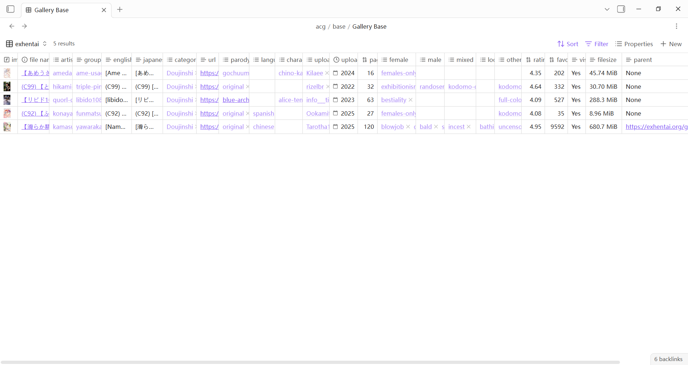
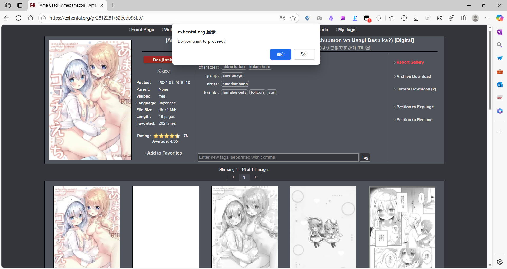
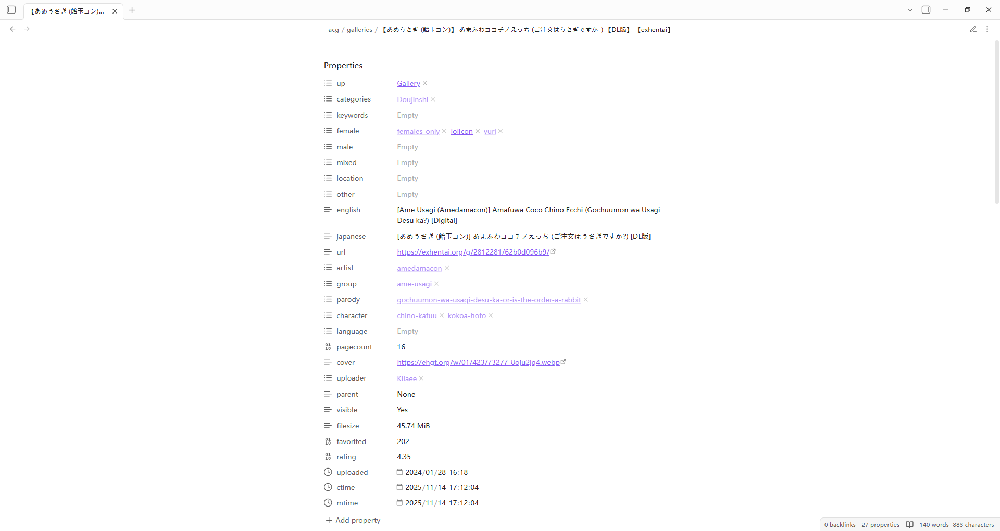
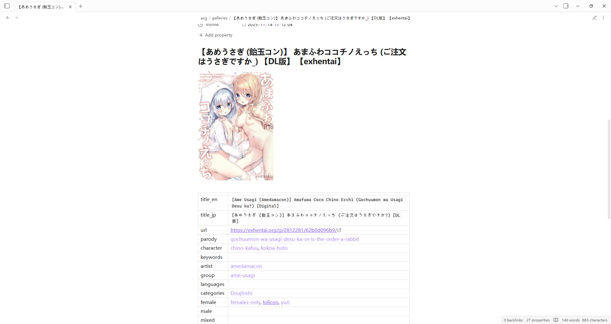
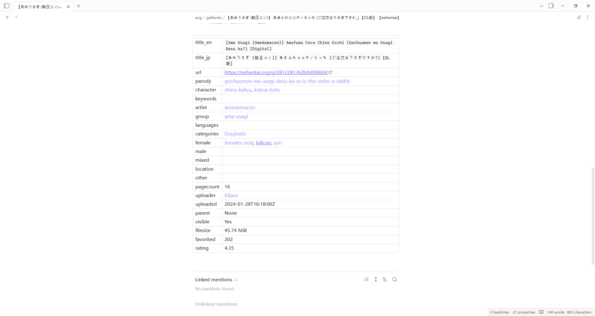

# exhentai-web-clipper-for-obsidian

🔞 A user script that exports EXHentai gallery metadata as Obsidian Markdown files (Obsidian EXHentai Web Clipper).

A generated markdown note example is shown below

```markdown
---
up:
  - "[[Gallery]]"
categories:
  - "[[Doujinshi]]"
keywords:
female:
  - "[[females-only]]"
  - "[[lolicon]]"
  - "[[yuri]]"
male:
mixed:
location:
other:
english: "[Ame Usagi (Amedamacon)] Amafuwa Coco Chino Ecchi (Gochuumon wa Usagi Desu ka?) [Digital]"
japanese: "[あめうさぎ (飴玉コン)] あまふわココチノえっち (ご注文はうさぎですか?) [DL版]"
url: https://exhentai.org/g/2812281/62b0d096b9/
artist:
  - "[[amedamacon]]"
group:
  - "[[ame-usagi]]"
parody:
  - "[[gochuumon-wa-usagi-desu-ka-or-is-the-order-a-rabbit]]"
character:
  - "[[chino-kafuu]]"
  - "[[kokoa-hoto]]"
language:
pagecount: 16
cover: https://ehgt.org/w/01/423/73277-8oju2jq4.webp
uploader:
  - "[[Kilaee]]"
parent: None
visible: Yes
filesize: 45.74 MiB
favorited: 202
rating: 4.35
uploaded: 2024-01-28T16:18:00Z
ctime: 2025-11-14T17:12:04+08:00
mtime: 2025-11-14T17:12:04+08:00
---

# 【あめうさぎ (飴玉コン)】 あまふわココチノえっち (ご注文はうさぎですか_) 【DL版】 【exhentai】


| | |
| --- | --- |
| title_en | `[Ame Usagi (Amedamacon)] Amafuwa Coco Chino Ecchi (Gochuumon wa Usagi Desu ka?) [Digital]` |
| title_jp | `[あめうさぎ (飴玉コン)] あまふわココチノえっち (ご注文はうさぎですか?) [DL版]` |
| url | https://exhentai.org/g/2812281/62b0d096b9/ |
| parody | [[gochuumon-wa-usagi-desu-ka-or-is-the-order-a-rabbit]] |
| character | [[chino-kafuu]], [[kokoa-hoto]] |
| keywords |  |
| artist | [[amedamacon]] |
| group | [[ame-usagi]] |
| languages |  |
| categories | [[Doujinshi]] |
| female | [[females-only]], [[lolicon]], [[yuri]] |
| male |  |
| mixed |  |
| location |  |
| other |  |
| pagecount | 16 |
| uploader | [[Kilaee]] |
| uploaded | 2024-01-28T16:18:00Z |
| parent | None |
| visible | Yes |
| filesize | 45.74 MiB |
| favorited | 202 |
| rating | 4.35 |
```

## How to use

First, install this user script at [[placehold]] (Note: the github repo is https://github.com/abc202306/exhentai-web-clipper-for-obsidian)

Then, when you navigate to the URL https://exhentai.net/g/*, click the "OK" button in the pop-up dialog box to save the current gallery's metadata as an Obsidian Markdown note file.

Additionally, you can download all image files linked to by external image links in the note file using the Obsidian command "Download attachments for current file".

## Screenshots

### 1. The example table view in the Obsidian vault



### 2. The example use case



### 3. The example generated markdown note file




